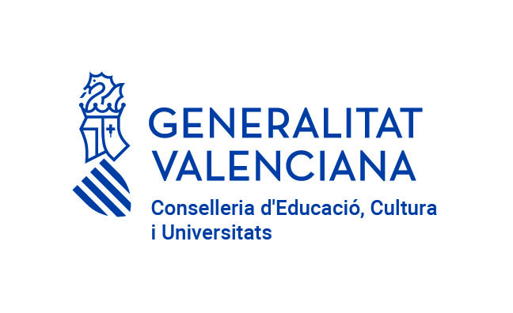
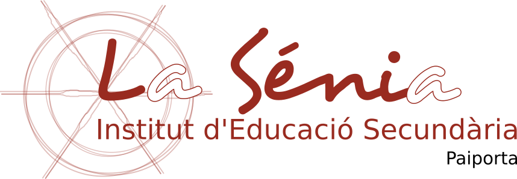
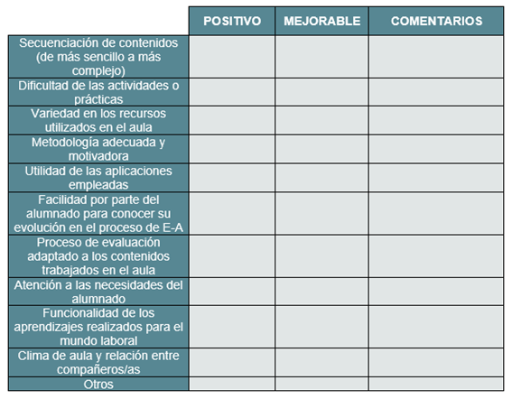

 
# Programació Didàctica

## DIGITALITZACIÓ
### 4t ESO

##### *CURS 2026 - 2027*
---

**Professor**: Juan Carlos Fernández Velasco

## ÍNDEX
1. OBJECTIUS
2. SABERS
3. DISTRIBUCIÓ TEMPORAL
4. METODOLOGIA DIDÀCTICA
5. AVALUACIÓ
6. MATERIALS I RECURSOS DIDÀCTICS
7. ACTIVITATS COMPLEMENTÀRIES I EXTRAESCOLARS
8. MESURES PER A LA INCLUSIÓ DE L'ALUMNAT AMB NECESITATS EDUCATIVES ESPECIALS
---
La matèria de Digitalització pretén introduir a l'alumnat en l'ús crític, conscient i informat de l'ampli ventall de ferramentes digitals empleades actualment, de manera quotidiana, en multitud de sectors de la nostra societat. L'objectiu principal és que el nostre alumnat puga participar, activament, en el món digital, de manera segura, ètica i responsable, reflexionant de manera conscient sobre els seus drets, obligacions i
possibilitats, mitjançant el desenrotllament d'unes certes destreses de naturalesa cognitiva i procedimental alhora que actitudinal que esta matèria pretén aportar-los.

# 1. OBJECTIUS
Els objectius poden definir-se com els referents relatius als assoliments que l'alumnat ha d'aconseguir en finalitzar el procés educatiu com a resultat de les experiències d'Ensenyança-Aprenentatge intencionalment planificades a tal fi.

## 1.1 OBJECTIUS GENERALS D'ETAPA
Segons **l'article 7 del RD 217/2022**, l'Educació Secundària Obligatòria contribuirà a
desenrotllar en l'alumnat les capacitats que els permeten:

1. a). Assumir responsablement els seus deures, conéixer i exercir els seus drets en el respecte a les altres persones, practicar la tolerància, la cooperació i la solidaritat entre les persones i grups, exercitar-se en el diàleg afermant els drets humans com a valors comuns d'una societat plural i preparar-se per a l'exercici de la ciutadania democràtica.
2. b). Desenrotllar i consolidar hàbits de disciplina, estudi i treball individual i en equip com a condició necessària per a una realització eficaç de les tasques de l'aprenentatge i com a mitjà de desenrotllament personal.
3. c). Valorar i respectar la diferència de sexes i la igualtat de drets i oportunitats entre ells. Rebutjar els estereotips que suposen discriminació entre hòmens i dones.
4. d). Enfortir les seues capacitats afectives en tots els àmbits de la personalitat i en les seues relacions amb les altres persones, així com rebutjar la violència, els prejuís de qualsevol tipus, els comportaments sexistes i resoldre pacíficament els conflictes.
5. e). Desenrotllar destreses bàsiques en la utilització de les fonts d'informació per a, amb sentit crític, adquirir nous coneixements. Desenrotllar les competències tecnològiques bàsiques i avançar en una reflexió ètica sobre el seu funcionament i utilització.
6. f). Concebre el coneixement científic com un saber integrat, que s'estructura en diferents disciplines, així com conéixer i aplicar els mètodes per a identificar els problemes en els diversos camps del coneixement i de l'experiència.
7. g). Desenrotllar l'esperit emprenedor i la confiança en si mateix, la participació, el sentit crític, la iniciativa personal i la capacitat per a aprendre a aprendre, planificar, prendre decisions i assumir responsabilitats.
8. h). Comprendre i expressar amb correcció, oralment i per escrit, en la llengua castellana i, si n'hi haguera, en la llengua cooficial de la comunitat autònoma, textos i missatges complexos, i iniciar-se en el coneixement, la lectura i l'estudi de la literatura.
9. i). Comprendre i expressar-se en una o més llengües estrangeres de manera apropiada.
10. j). Conéixer, valorar i respectar els aspectes bàsics de la cultura i la història pròpies i de les altres persones, així com el patrimoni artístic i cultural.
11. k). Conéixer i acceptar el funcionament del propi cos i el dels altres, respectar les diferències, afermar els hàbits de cura i salut corporals i incorporar l'educació física i la pràctica de l'esport per a afavorir el desenrotllament personal i social. Conéixer i valorar la dimensió humana de la sexualitat en tota la seua diversitat. Valorar críticament els hàbits socials relacionats amb la salut, el consum, la cura, l'empatia i el respecte cap als éssers vius, especialment els animals, i el medi ambient, contribuint a la seua conservació i millora.
12 l). Apreciar la creació artística i comprendre el llenguatge de les diferents manifestacions artístiques, utilitzant diversos mitjans d'expressió i representació.

# 2. SABERS
Els sabers bàsics són els coneixements, destreses i actituds que constituïxen els continguts propis d'una matèria i l'aprenentatge de la qual és necessari per a l'adquisició de les competències específiques.
Els sabers bàsics necessaris per a l'adquisició i desenrotllament de les competències específiques d'esta assignatura s'organitzen en quatre blocs: programació, sistemes informàtics, xarxes i servicis en xarxa. Com s'ha indicat prèviament, cada bloc està relacionat directament amb una competència específica, mentres que la quinta competència implica els quatre blocs de sabers.
En la present programació els sabers han sigut seleccionats i distribuïts per Unitats Didàctiques d'acord amb el criteri determinat pel departament. Destacar que alguns dels sabers especificats en el DECRET 107/2022, de 5 d'agost, es veuran de manera transversal al llarg del curs.

---
**UD1: Ciutadania digital crítica– digitalització.**
- Busca, selecció i arxiu d'informació.
- Edició i creació de continguts: aplicacions de productivitat, desenrotllament d'aplicacions senzilles per a dispositius mòbils i web, realitat virtual, augmentada i
mixta.
- Comunicació i col·laboració en xarxa.
- Publicació i difusió responsable en xarxes.
- Estratègies per a una ciberconvivència igualitària, segura i saludable. Etiqueta digital.
- La privacitat en la xarxa. La protecció de les dades de caràcter personal. Informació i consentiment.
- Alfabetització mediàtica i llibertat d'expressió.
- Hàbits, conductes i estratègies comunicatives per al debat crític a través de la xarxa.
- Ferramentes per a detectar notícies falses i faules.
- Ciutadania digital. Servicis públics en línia. Registres digitals.
- Sistemes d'identificació en la xarxa. El certificat i la firma digital. Contrasenyes segures.
- El comerç electrònic. Estàndards d'intercanvi electrònic de dades.
- Formes de pagament. Monedes digitals. Criptomonedes.
- Estratègies per a detecció de fraus.
- Implicacions ètiques del big data i la intel·ligència artificial.
- Biaixos algorítmics i ideològics.
- Obsolescència programada.
- Sobirania tecnològica i digitalització sostenible.
- Plataformes d'iniciativa ciutadana.
- Activisme digital. Cibervoluntariat.
- Comunitats de desenrotllament de maquinari i programari lliure.
- Responsabilitat ecosocial de les tecnologies digitals. Criteris d'accessibilitat, sostenibilitat i im-pacte mediambiental.
---
** UD2: Sistemes informàtics – Arquitectura d'equips:**
- Unitats de mesura. Sistemes de representació digital de la informació.
- Disseny d'un ordinador personal. Elements, components físics i les seues característiques.
- Criteris de selecció dels components d'un ordinador personal. Muntatge d'ordinadors personals. Simuladors de maquinari. Configuració de components.
- Actitud crítica i raonada per a la utilització dels equips informàtics. Consum responsable d'equipament informàtic. Sostenibilitat.
- Interacció dels components de l'equip informàtic en el seu funcionament. Prestacions i rendiment.
- Dispositius mòbils. Característiques bàsiques.
- Estratègies per a la prevenció de problemes tècnics.
- Ferramentes de monitoratge.
- Detecció i solució de problemes en equips informàtics i xarxes.
---
**UD3: Sistemes informàtics:**
- Sistemes operatius per a ordinadors personals i dispositius mòbils.
- Instal·lació, configuració, actualització i desinstal·lació d'aplicacions.
---
**UD4 - Xarxes**
- Tipus de xarxes d'ordinadors. Xarxes cablejades i sense fils.
- Dispositius de xarxa. Internet de les coses
- Instal·lació, configuració i manteniment de xarxes personals i domèstiques. Simulació de xarxes.
- Servicis d'Internet: www, correu electrònic, videoconferència, missatgeria.
---
**UD5: Desenrotllament Web**
- Creació de continguts digitals amb ferramentes ofimàtiques, multimèdia i de desenrotllament web.
- Ferramentes col·laboratives d'edició de continguts digitals.
- Gestió i organització del treball en xicotets grups. Rols en el disseny, producció i publicació.
- Publicació multimèdia. Publicació web en servidors web i sistemes gestors de continguts.
- Blogs i fòrums com a ferramentes de publicació i col·laboració en línia.
---
**UD6: Edició d'imatge digital**
- Creació de continguts digitals amb ferramentes ofimàtiques, multimèdia i de desenrotllament web
- Estètica i llenguatge audiovisual
**UD7: Edició de so**
- Creació de continguts digitals amb ferramentes ofimàtiques, multimèdia i de desenrotllament web
- Estètica i llenguatge audiovisual
---
**UD8: Edició de vídeo**
- Creació de continguts digitals amb ferramentes ofimàtiques, multimèdia i de desenrotllament web
- Estètica i llenguatge audiovisual
---
**UD9: Programació**
- Algorismes i entorns de desenrotllament de programari.
- Desenrotllament d'aplicacions senzilles per a ordinadors personals, dispositius mòbils i web. Aplicacions de realitat virtual, augmentada i mixta.
- Intel·ligència artificial en aplicacions informàtiques.
---
**UD10: Seguretat i digitalització**
- Ús segur de dispositius i dades. Ferramentes de seguretat.
- Mesures preventives i correctives per a fer front a riscos, amenaces i atacs a dispositius.
- Gestió de la identitat digital. L'empremta digital.
- La privacitat en la xarxa. Configuració en xarxes socials La protecció de les dades de caràcter personal. Informació i consentiment.
- Tipus de cercadors web i les seues ferramentes de filtrat.
- Selecció d'informació en mitjans digitals a través de cercadors web contrastant la seua veracitat.
- Propietat intel·lectual. Tipus de drets, duració, límits als drets d'autoria i  licències de distribució i explotació.
---
**UD11: benestar digital**
- Mesures per a protegir la salut física. Ergonomia. Mesures per a salvaguardar el benestar personal.
- Implicacions de l'ús dels dispositius digitals sobre la salut, la sostenibilitat i el  medi ambient.
- Protecció contra situacions de violència i de risc en la xarxa.
- Actituds per a preservar el benestar digital aplicant les mesures necessàries.
---
# 3. DISTRIBUCIÓ TEMPORAL DELS SABERS
La distribució de les unitats en les diferents avaluacions quedaria de la manera següent:

| *Unitat*| *Aval1*| *Aval2*|*Aval3*|
|------|:------:|:------:|:------:|
|UD1: Ciutadania digital crítica– digitalització.|*X*| | |
|UD2: Sistemes informàtics – Arquitectura|*X*| | |
|UD3: Sistemes informàtics – Sistemes Operatius|*X*| | |
|UD4: Xarxes|*X*|*X*| |
|UD5: Desenrrotllament Web|*X*|*X*| |
|UD6: Edició d’imatge digital| |*X*| |
|UD7: Edició de So| |*X*|*X*|
|UD8: Edició de Vídeo| |*X*|*X*|
|UD9: Programació| | |*X*|
|UD10: Seguretat i digitalització| | |*X*|
|UD11: Benestar digital| | |*X*|

# 4. METODOLOGIA DIDÀCTICA
Segons el Decret 108/2022 Les estratègies metodològiques que s'han d'aplicar seran actives, basades en l'aprenentatge cooperatiu o col·laboratiu amb les quals l'alumnat desenrotllarà la seua autonomia i la seua capacitat d'aprendre a aprendre. A més, contribuiran a solucionar situacions d'inequitat o exclusió, de manera pacífica, generosa i creativa, i a gestionar la incertesa i el sentiment d'incompetència. Estes estratègies fomentaran el treball en equips amb diversitat personal i cultural, el compromís ciutadà a nivell local i global, el coneixement com a motor de desenrotllament i l'aprofitament crític, ètic i responsable de la cultura digital.

La metodologia a seguir consistirà a presentar al principi de cada una de les unitats un conjunt de conceptes de la matèria objecte de l'aprenentatge sobre la pissarra o utilitzant el projector. Seguidament es proposaran exercicis i activitats pràctiques que podran ser avaluables o no.

Mentres els alumnes realitzen les pràctiques, el professor els atendrà en els dubtes que puguen sorgir i els explicarà conceptes suplementaris que puguen ser-los d'ajuda.

Les classes s'impartiran amb l'ajuda de la pissarra digital. També s'utilitzarà la plataforma Moodle (aules.edu.gva.es) i diferents tutorials com a suport a les pràctiques.

# 5. AVALUACIÓ
## 5.1 CARACTERÍSTIQUES DE L’AVALUACIÓ
Es pot definir l'avaluació com un procés mitjançant el qual, a partir de criteris prèviament establits determinats per la contextualització i interiorització dels objectius per avaluadors i avaluats, s'obté informació variada que permet emetre un juí de valor integral sobre el desenrotllament individual i grupal aconseguit, la qual cosa facilita l'adopció de decisions reguladores en un procés d'Ensenyança- Aprenentatge.

Per a dur a terme el procés d'avaluació, es tindrà en compte el que es disposa en el Títol IV. Avaluació, promoció, titulació i documents oficials d'avaluació del decret DECRET 107/2022. Esta Orde arreplega que l'avaluació de l'alumnat d'Educació Secundària Obligatòria ha de ser contínua (atés que es tindrà en compte tot el procés d'Ensenyança-Aprenentatge) i diferenciada segons les diferents matèries, tenint un caràcter formatiu i constituint una ferramenta idònia per a la millora tant dels processos d'ensenyança com dels processos d'aprenentatge.

## 5.2 CRITERIS D’AVALUACIÓ
A continuació es mostren els criteris d'avaluació associades a les competències específiques exposades anteriorment segons el decret 107/2022:

**Competència específica 1. Criteris d’avaluació.**

*CE1. Dissenyar equips i xarxes de comunicació d’ús personal i domèstic, administrar-los i utilitzar-losde manera segura i sostenible.*

1.1. Dissenyar ordinadors personals prenent decisions raonades, sobre la base dels seus requeriments, així com la sostenibilitat i el consum responsable.
1.2. Dissenyar xarxes domèstiques aplicant els coneixements i processos associats a sistemes de comunicacions cablejats i sense fil.
1.3. Connectar components de sistemes informàtics i xarxes domèstiques, utilitzant dispositius físics o simuladors.
1.4. Instal·lar, utilitzar i mantindre sistemes operatius i aplicacions, configurant-ne  les característiques en funció de les necessitats personals.
1.5. Administrar dispositius mòbils i xarxes domèstiques de manera segura i sostenible, segons l’ús per al qual estan destinats.
1.6. Participar en equips de treball per a dissenyar, administrar i utilitzar equips i xarxes de comunicació, respectant els rols assignats i les aportacions de la resta d’integrants del grup.

---
**Competència específica 2. Criteris d’avaluació.**

*CE2. Buscar, seleccionar i organitzar la informació en l’entorn personal d’aprenentatge, i utilitzar-la per a la creació, edició, publicació i difusió de continguts digitals.*

2.1. Buscar i seleccionar informació en funció de les seues necessitats a partir de diverses fonts amb sentit crític, contrastant-ne la veracitat, fent ús de les eines de l’entorn personal d’aprenentatge i seguint les normes bàsiques de seguretat en la xarxa.
2.2. Organitzar i gestionar l’entorn personal d’aprenentatge mitjançant la integració de recursos digitals de manera autònoma.
2.3. Crear, integrar i editar continguts digitals amb sentit estètic de manera individual o col·lectiva, seleccionant les eines més apropiades per a generar un nou coneixement i continguts digitals de manera creativa, i respectant els drets d’autoria.
2.4. Programar aplicacions senzilles multiplataforma de manera creativa, de manera individual o col·lectiva, respectant els drets d’autoria i llicències d’ús.
2.5. Compartir i publicar informació i dades interactuant en espais virtuals de comunicació i plataformes d’aprenentatge col·laboratiu, adaptant-se a diferents audiències amb una actitud participativa i respectuosa.
2.6. Participar en equips de treball per a afavorir l’aprenentatge permanent mitjançant entorns digitals.

---
**Competència específica 3. Criteris d’avaluació.**

*CE3. Mostrar hàbits que fomenten el benestar en entorns digitals aplicant mesures preventives i correctives per a protegir dispositius, dades personals i la pròpia salut.*

3.1. Dissenyar, utilitzar i mantindre estratègies bàsiques de seguretat en dispositius  igitals i xarxes de comunicació, salvaguardant els equips i la informació que contenen.
3.2. Protegir les dades personals i la identitat digital, configurant adequadament les condicions de privacitat de les xarxes socials i espais virtuals de treball.
3.3. Adoptar conductes proactives que protegisquen les persones i fomenten relacions personals respectuoses i enriquidores.
3.4. Identificar i saber reaccionar davant de situacions que representen amenaces a través de dispositius digitals, triant la millor solució entre diverses opcions i valorant el benestar personal i col·lectiu.
3.5. Prendre mesures de prevenció davant dels riscos derivats de l’ús continuat de dispositius digitals.
3.6. Mostrar empatia cap als membres del grup reconeixent les seues aportacions i establint un diàleg igualitari per a resoldre conflictes i discrepàncies.

---
**Competència específica 4. Criteris d’avaluació.**

*CE4. Exercir una ciutadania digital crítica mitjançant un ús actiu, responsable i ètic dels mitjans digitals, el comerç electrònic i l’administració digital en la societat de la
informació.*

4.1. Fer un ús ètic de les dades i de les eines digitals, aplicant l’etiqueta digital, col·laborant i participant activament en la xarxa.
4.2. Reconéixer les aportacions de les plataformes digitals en les gestions administratives i el comerç electrònic, sent conscient de la bretxa d’accés, ús i aprofitament per a diversos col·lectius.
4.3. Valorar la importància de l’oportunitat, facilitat i llibertat d’expressió que suposen els mitjans digitals i comunitats virtuals per a poder exercir un activisme ètic i responsable.
4.4. Analitzar de manera crítica el missatge transmés en mitjans digitals, tenint-ne en compte l’objectivitat, ideologia, intencionalitat, biaixos i caducitat.
4.5. Analitzar la necessitat i els beneficis globals d’un ús i desenvolupament ecosocialment responsable de les tecnologies digitals, tenint en compte criteris d’accessibilitat, sostenibilitat i impacte.

---
**Competència específica 5. Criteris d’avaluació**

*CE5. Afrontar els desafiaments informàtics i digitals que la societat de la informació planteja en els àmbits personal, domèstic i educatiu, i formular possibles solucions*
 
5.1. Gestionar situacions d’incertesa en entorns digitals amb una actitud positiva, i afrontar-les utilitzant el coneixement adquirit i sentint-se competent.
5.2. Desenvolupar projectes de digitalització en l’entorn quotidià amb iniciativa, analitzant les situacions des de diferents punts de vista i proposant solucions creatives.
5.3. Assumir proactivament responsabilitats en el marc d’un grup de treball per a abordar desafiaments concrets propis d’una societat digitalitzada i aconseguir metes conjuntes.
5.4. Resoldre problemes tècnics senzills analitzant components i funcions dels dispositius digitals, avaluant les solucions de manera crítica i reformulant el procediment utilitzat en cas necessari.

---
## 5.3 CRITERIS DE CALIFICACIÓ
Tal i com s’estableix en l’Annex III, apartat 6, del DECRET 107/2022, de 5 d'agost, del Consell, l’avaluació ha de realitzar-se a partir dels Criteris d’Avaluació de les Competències específiques.
Tenint en compte, per una banda, la relació entre les unitats didàctiques proposades i les Competències Específiques i, per altra banda, la secuenciació d’eixos continguts, s’ha decidit donar un pes diferent a cada una de les Competències Específiques, tal i com
es mostra en la següent taula:

| Competències Específiques. Criteris de Qualificació | Unitats didàctiques| Percentatge nota |
|------|------|------|
|**CE1**: Dissenyar equips i xarxes de comunicació d’ús personal i domèstic, administrar-los i utilitzar-los de manera segura i sostenible.| UD2, UD3, UD4 | 25% |
|**CE2**: Buscar, seleccionar i organitzar la informació en l’entorn personal d’aprenentatge, i utilitzar-la per a la creació, edició, publicació i difusió de continguts digitals.| UD5, UD6, UD7, UD8, UD9 | 50%|
|**CE3**: Mostrar hàbits que fomenten el benestar en entorns digitals aplicant mesures preventives i correctives per a protegir dispositius, dades personals i la pròpia salut.| UD10, UD11 | 10% |
|**CE4**: Exercir una ciutadania digital crítica mitjançant un ús actiu, responsable i ètic dels mitjans digitals, el comerç electrònic i l’administració digital en la societat de la informació | UD1 | 10%|
|**CE5**: Afrontar els desafiaments informàtics i digitals que la societat de la informació planteja en els àmbits personal, domèstic i educatiu, i formular possibles solucions.| Transversal a totes les unitats didàctiques | 5% |
| |**Total**| 100% |

A l’hora de traduir aquestes qualificacions numèriques a les indicades en l’Article 36 del DECRET 107/2022, de 5 d'agost del Consell, atendrem a les indicacions de l’Article 10 del DECRET 66/2024, de 21 de juny, del Consell, pel qual es modifica el Decret 107/2022, de manera que l’apartat 13 de l’article 36, que queda redactat en els termes següents:

“13. Els resultats de l'avaluació s'expressaran en els termes que disposa l'article
31.2 del Reial decret 217/2022. A estos termes s'adjuntarà, amb caràcter informatiu, una qualificació numèrica, sense utilitzar decimals, en una escala d'un a deu, amb les correspondències següents:
- Insuficient: 1, 2, 3 o 4.
- Suficient: 5.
- Bé: 6.
- Notable: 7 o 8.
- Excel·lent: 9 o 10.”

A fi d’evitar imprecissions, seguirem l’acord de centre pres en la COCOPE del dijous 13 d’octubre de 2022 i que les resumeix de la forma que es presenta a continuació:
- Insuficient (IN): qualificacions inferiors al 5 (0-4’99).
- Suficient (SU): qualificacions positives (majors de 5) inferiors al 6 (5-5’99).
- Bé (BE): qualificacions positives inferiors al 7 i no menors de 6 (6-6’99).
- Notable (NT): qualificacions positives inferiors al 9 i no menors de 7 (7-8’99).
- Excel·lent (EX): qualificacions positives entre 9 i 10 (9-10).

D’altra banda, i per a finalitzar, també es tindran en compte les faltes d’ortografia en les proves escrites i/o en els treballs, de manera que es valorarà la correcta escriptura i ortografia i queda a criteri de cada professor/a l’adopció de mecanismes per a la seua recuperació (com ara, proposar un treball consistent en escriure tres frases correctes amb dita paraula ben escrita per tal de recuperar les faltes d’ortografia), de manera que les faltes no suposen una reducció de la qualificació del treball i/o examen de l’alumne.

## 5.5 AVALUACIÓ DE LA PRÀCTICA DOCENT
Tot el procés d'avaluació, en els seus diferents aspectes, ha de servir per a reflexionar, canviar l'inadequat i millorar any a any la pràctica docent, les programacions i el desenrotllament de les ensenyances. És per este motiu que el professor aplicarà dos tipus d'avaluació de la pràctica docent. En primer lloc una autoavaluació i, en segon lloc, una avaluació per part de l'alumnat que li permeta veure des d'una altra perspectiva quins aspectes serien, segons els discents, susceptibles de millora. En este sentit, dins de cada tipus d'avaluació s'englobarien qüestions com:

### 5.5.1 AUTOAVALUACIÓ DE LA PRÀCTICA DOCENT.
- El grau de consecució dels objectius en cada unitat de treball
- Metodologia aplicada, si és l'adequada o no, així com si les activitats proposades han sigut motivadores o no.
- Atenció a la diversitat, on s'analitzarà si s'ha disposat del temps necessari per a atendre la diversitat
- Clima de l'aula, analitzant la distribució de la classe, el tipus de grups de treball i les mesures correctores dutes a terme.
- Activitats complementàries: si han sigut motivadores, interessants i si la temporalització ha sigut la més favorable.

### 5.5.2 L'AVALUACIÓ DE LA PRÀCTICA DOCENT PER PART DE L'ALUMNAT
Consistirà en una enquesta amb els mateixos ítems que haurà utilitzat el professor per a autoavaluar-se i que es realitzarà en finalitzar el curs, anònima i contrastada amb la de la resta de professors/as del departament. A continuació es mostren la taula d'exemple amb alguns dels ítems que s'utilitzarien per a dur a terme l'autoavaluació docent i l'avaluació per part dels discents.

Este tipus d'accions permeten fer els canvis oportuns i perfeccionar l'acció docent mitjançant cursos formatius, seminaris, participació en congressos i que faran d'esta programació un element viu i útil per a dur a terme la labor docent.

# 6. MATERIALS i RECURSOS DIDÀCTICS
S'empraran els següents recursos materials:
- Pissarra digital
- Programari: LibreOffice, VisualStudio Code, Blockly, AppInventor, Inkscape, Audacity, Kdenlive, etc.
- Plataforma [Moodle Aules de la Conselleria d’Educació de la Generalitat Valenciana](https://portal.edu.gva.es/aules).
- Apunts, Documents, Pràctiques guiades.
- Videotutorials

# 7. ACTIVITATS COMPLEMENTÀRIES I EXTRAESCOLARS
De moment, no s'ha concretat cap activitat extraescolar. Si sorgira l'oportunitat es realitzarà alguna activitat complementària que segons criteri de l'equip docent fora molt interessant per a l'alumnat en pro de la seua formació.
Les activitats es realitzaran sempre que el nombre d'assistents supere un mínim exigit pel Departament, el Centre o la institució que es visite.

# 8. MESURES PER A LA INCLUSIÓ DE L'ALUMNAT AMB NEE
S'entén per **diversitat** els diferents ritmes, interessos i estils d'aprenentatge de l'alumnat. Així, es definix com a **“atenció a la diversitat”** el conjunt d'accions que intenten previndre i donar resposta a les necessitats temporals o permanents de l'alumnat. Esta programació pretén aconseguir l'equitat mitjançant l'atenció individualitzada a tota mena de diversitat. Per això, es basa en el Títol II de la LOE modificada per la LOMCE sobre equitat i en el capítol V del Decret 87/2015. 

D'altra banda, també s'ha pres en consideració el que es disposa en el Decret 104/2018 que definix la inclusió i l'equitat en el sistema educatiu a la Comunitat Valenciana i en l'Orde de 20/2019, de 30 d'abril, de la Conselleria d'Educació, Investigació, Cultura i Esport, per la qual es regula l'organització de la resposta educativa per a la inclusió de l'alumnat en els centres docents sostinguts amb fons públics del sistema educatiu valencià. 

Així mateix, també es fa referència a la Resolució de 5 de juliol de 2019, per la qual es dicten instruccions i orientacions per a actuar en l'acolliment d'alumnat nouvingut.

Concretant un poc més la normativa anterior cal destacar que la Llei orgànica 2/2006, modificada per la Llei orgànica 3/2020, de 29 de desembre, especifica que serà necessari prestar especial atenció a la diversitat de l'alumnat, l'atenció individualitzada, la prevenció de les dificulteu d'aprenentatge i la posada en pràctica de mecanismes de reforç. En esta mateixa línia en el Decret 108/2022 contemplem que la intervenció educativa ha de ser individualitzada, reconeixent les potencialitats i necessitats específiques de cada alumne/a.

D'esta manera, amb l'objectiu d'aconseguir una atenció individualitzada i realitzar les
adaptacions necessàries per a cada alumne, tindrem en compte diferents referents
legals.

Així mateix, el DECRET 104/2018, de 27 de juliol, del Consell, pel qual es desenrotllen els principis d'equitat i d'inclusió en el sistema educatiu valencià, a fi de determinar les actuacions pertinents cap a l'alumnat amb necessitat específica de suport educatiu o de compensació educativa determinant **MESURES de NIVELL III I IV**.
Contemplada la normativa i tenint clar que l'atenció als nostres alumnes es farà de manera individualitzada, reconeixent les potencialitats i necessitats específiques de cada un, convé remarcar que la nostra actuació educativa, es realitzarà sobre la base dels següents principis:

- Tindrem en compte mesures d'ensenyança adaptativa, on els objectius i continguts es mantenen estables, mentres que la forma en què els alumnes s'aproximen a la seua adquisició serà la que canvia.
- Es proposaran activitats diversificables, és a dir, la mateixa per a tots però amb diferent grau de dificultat, i diverses, sent diferents per a cada alumne o grup, en funció de les seues capacitats, destreses, interessos i motivació.
- Tindrem en compte les mesures d'atenció a la diversitat propi del centre.

Una vegada contextualitzada la normativa i algunes actuacions de caràcter general referents a l'atenció a la diversitat, es destaca el fet que la present programació esta centrada en un grup únicament de quatre alumnes amb bons resultats acadèmics i molta predisposició al treball, per la qual cosa les actuacions indicades anteriorment, en principi no han de ser tingudes en compte donada la naturalesa d'estos alumnes.

