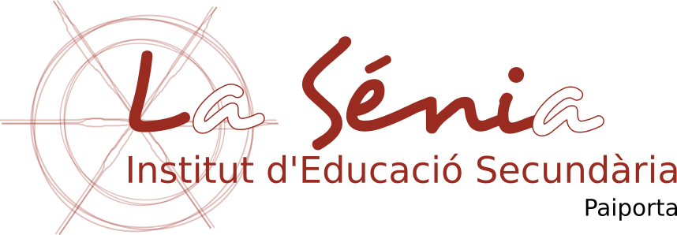
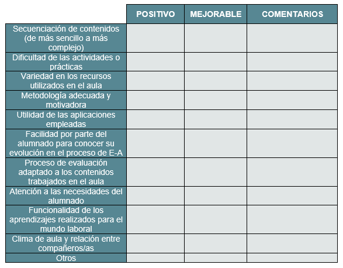

# Programación didáctica

## Informática I

### 1º BACHILLERATO

### *2026 - 2027*
---

**Profesor**: César Tomás Franco

## ÍNDICE

1\. OBJETIVOS

2\. SABERES

3\. DISTRIBUCIÓN TEMPORAL

4\. METODOLOGÍA DIDÁCTICA

5\. EVALUACIÓN

6\. MATERIALES Y RECURSOS DIDÁCTICOS

7\. ACTIVIDADES COMPLEMENTARIAS

8\. MEDIDAS PARA LA INCLUSIÓN DEL ALUMNADO CON NECESIDADES EDUCATIVAS
ESPECIALES

 

## **1. OBJETIVOS**

Los objetivos pueden definirse como los referentes relativos a los logros que el alumno debe alcanzar al finalizar el proceso educativo como resultado de las experiencias de Enseñanza-Aprendizaje intencionalmente planificadas a tal fin.

### 1.1 OBJETIVOS GENERALES DE ETAPA

Según el artículo 7 del RD 243/2022, el bachillerato contribuirá a desarrollar en el alumnado las capacidades que les permitan:
- a) Ejercer la ciudadanía democrática, desde una perspectiva global, y adquirir una conciencia cívica responsable, inspirada por los valores de la Constitución Española, así como por los derechos humanos, que fomente la corresponsabilidad en la construcción de una sociedad justa y equitativa.
- b) Consolidar una madurez personal, afectivo-sexual y social que les permita actuar de forma respetuosa, responsable y autónoma y desarrollar su espíritu crítico. Prever, detectar y resolver pacíficamente los conflictos personales, familiares y sociales, así como las posibles situaciones de violencia.  
- c) Fomentar la igualdad efectiva de derechos y oportunidades de mujeres y hombres, analizar y valorar críticamente las desigualdades existentes, así como el reconocimiento y enseñanza del papel de las mujeres en la historia e impulsar la igualdad real y la no discriminación por razón de nacimiento, sexo, origen racial o étnico, discapacidad, edad, enfermedad, religión o creencias, orientación sexual o identidad de género o cualquier otra condición o circunstancia personal o social.  
- d) Afianzar los hábitos de lectura, estudio y disciplina, como condiciones necesarias para el eficaz aprovechamiento del aprendizaje, y como medio de desarrollo personal.  
- e) Dominar, tanto en su expresión oral como escrita, la lengua castellana y, en su caso, la lengua cooficial de su comunidad autónoma.  
- f) Expresarse con fluidez y corrección en una o más lenguas extranjeras.  
- g) Utilizar con solvencia y responsabilidad las tecnologías de la información y la comunicación.  
- h) Conocer y valorar críticamente las realidades del mundo contemporáneo, sus antecedentes históricos y los principales factores de su evolución. Participar de forma solidaria en el desarrollo y mejora de su entorno social.  
- i) Acceder a los conocimientos científicos y tecnológicos fundamentales y dominar las habilidades básicas propias de la modalidad elegida.  
- j) Comprender los elementos y procedimientos fundamentales de la investigación y de los métodos científicos. Conocer y valorar de forma crítica la contribución de la ciencia y la tecnología en el cambio de las condiciones de vida, así como afianzar la sensibilidad y el respeto hacia el medio ambiente.  
- k) Afianzar el espíritu emprendedor con actitudes de creatividad, flexibilidad, iniciativa, trabajo en equipo, confianza en uno mismo y sentido crítico.  
- l) Desarrollar la sensibilidad artística y literaria, así como el criterio estético, como fuentes de formación y enriquecimiento cultural.  
- m) Utilizar la educación física y el deporte para favorecer el desarrollo personal y social. Afianzar los hábitos de actividades físico-deportivas para favorecer el bienestar físico y mental, así como medio de desarrollo personal y social.  
- n) Afianzar actitudes de respeto y prevención en el ámbito de la movilidad segura y saludable.  
- o) Fomentar una actitud responsable y comprometida en la lucha contra el cambio climático y en la defensa del desarrollo sostenible. 

### **2. SABERES**

Los saberes básicos son los conocimientos, destrezas y actitudes que constituyen los contenidos propios de una materia y cuyo aprendizaje es necesario para la adquisición de las competencias específicas.

Para esta asignatura de Informática I, los saberes básicos se organizan según la nueva normativa en cuatro grandes bloques: Hardware y software, Contenido digital y trabajo colaborativo, Introducción a la programación, y Seguridad, ética y bienestar digital.

En la presente programación los saberes han sido seleccionados y distribuidos por Unidades Didácticasde acuerdo al criterio determinado por el departamento:

### UD1: Seguridad, Ética, Markdown y Presentaciones

- Identidad digital y huella digital.
- Estrategias para una convivencia segura y saludable. Situaciones de riesgo en la red y medidas preventivas.  \- Privacidad y protección de datos de carácter personal.  
- La inteligencia artificial: riesgos y sesgos.  
- Propiedad intelectual, derechos de autor y tipos de licencias.  
- Edición estructurada de contenidos (Markdown) e integración en presentaciones electrónicas.  

### UD2: Hardware y Sistemas Informáticos

- Elementos y componentes del hardware del ordenador: alimentación, placa base, procesador, memoria, dispositivos de almacenamiento y periféricos.  
- Elaboración de presupuestos de un ordenador con unas características dadas.
- Montaje, configuración y resolución de problemas.  
- Tipos de conectores y controladores. Conexión y configuración de dispositivos.  

### UD3: Sistemas Operativos y Aplicaciones

- Secuencia de arranque del ordenador, gestor de arranque y configuración de la BIOS.
- Tipos de sistemas operativos: libres y propietarios. Instalación de sistemas operativos y configuración básica en ámbito doméstico.  
- Usuarios y permisos. Elaboración de manuales de instalación.  
- Software de utilidad, libre y propietario. Instalación y prueba de aplicaciones.  

### UD4: Procesadores de Textos e Inteligencia Artificial

- Suites ofimáticas de escritorio y web. Procesadores de texto: Estilos, formatos y plantillas.
- Tablas, gráficos, listas y esquemas.  
- Índices, referencias cruzadas y combinación de documentos.  
- Diseño de prompts con herramientas de inteligencia artificial generativa.  

### UD5: Hojas de Cálculo

- Hojas de cálculo: fórmulas y funciones.  
- Generación de gráficos y explotación de datos.  

### UD6: Imágenes Vectoriales y Nube

- Creación de imágenes con herramientas de dibujo vectorial.  
- Herramientas de trabajo colaborativo en red y cloud computing.  
- Sincronización de dispositivos. Herramientas de difusión y publicidad de contenidos.  

### UD7: Introducción a la Programación

- Conceptos básicos del pensamiento computacional.  
- Variables y sintaxis. Tipos de datos.  
- Lectura y escritura de datos.  
- Estructuras de control básicas.  
- Desarrollo de programas sencillos en lenguajes estructurados. 

## **3. DISTRIBUCIÓN TEMPORAL DE LOS SABERES**

La distribución de las unidades en las distintas evaluaciones quedaría de la siguiente manera:
     
| UD | Eval 1 | Eval 2 | Eval 3 |
| --- | --- | --- | --- |
| **UD1:** Seguridad, Ética, Markdown y Presentaciones | X |  |  |
| **UD2:** Hardware y Sistemas Informáticos | X |  |  |
| **UD3:** Sistemas Operativos y Aplicaciones | X |  |  |
| **UD4:** Procesadores de Textos e IA |  | X |  |
| **UD5:** Hojas de Cálculo |  | X |  |
| **UD6:** Imágenes Vectoriales y Nube |  | X |  |
| **UD7:** Introducción a la Programación |  |  | X |

## **4. METODOLOGÍA DIDÁCTICA**

Según el Decreto 108/2022 Las estrategias metodológicas que se deben aplicar serán activas, basadas en el aprendizaje cooperativo o colaborativo con las que el alumnado desarrollará su autonomía y su capacidad de aprender a aprender. Además, contribuirán a solucionar situaciones de inequidad o exclusión, de forma pacífica, generosa y creativa, y a gestionar la incertidumbre y el sentimiento de incompetencia. Estas estrategias fomentarán el trabajo en equipos con diversidad personal y cultural, el compromiso ciudadano a nivel local y global, el conocimiento como motor de desarrollo y el aprovechamiento crítico, ético y responsable de la cultura digital.

La metodología a seguir consistirá en presentar al principio de cada una de las unidades un conjunto de conceptos de la materia objeto del aprendizaje sobre la pizarra o utilizando el proyector. Seguidamente se propondrán ejercicios y actividades prácticas que podrán ser evaluables
o no.

Mientras los alumnos realizan las prácticas, el profesor les atenderá en las dudas que puedan surgir y les explicará conceptos suplementarios que puedan serles de ayuda.

Las clases se impartirán con la ayuda de la pizarra digital. También se utilizará la plataforma Moodle (aules.edu.gva.es) y diferentes tutoriales como apoyo a las prácticas.

## **5. EVALUACIÓN**

### 5.1 CARACTERÍSTICAS DE LA EVALUACIÓN

**Se puede definir la evaluación** como un proceso mediante el cual, a partir de criterios previamente establecidos determinados por la contextualización e interiorización de los objetivos por evaluadores y evaluados, se obtiene información variada que permite emitir un juicio de valor integral sobre el desarrollo individual y grupal alcanzado, lo que facilita la adopción de decisiones reguladoras en un proceso de Enseñanza-Aprendizaje.

Para llevar a cabo el proceso de evaluación, se tendrá en cuenta lo dispuesto en el Título IV. Evaluación, promoción, titulación y documentos oficiales de evaluación del decreto DECRETO 108/2022. Esta Orden recoge que la evaluación del alumnado de Bachillerato debe ser continua (dado que se tendrá en cuenta todo el proceso de Enseñanza-Aprendizaje) y diferenciada según las diferentes materias, teniendo un carácter formativo y constituyendo una herramienta idónea para la mejora tanto de los procesos de enseñanza como de los procesos de aprendizaje.

De acuerdo con lo establecido en el **DECRETO 107/2022, de 5 de agosto, del Consell**, la evaluación se realizará a partir de los **criterios de evaluación de las competencias específicas**. La calificación final de la materia se basará en la valoración del progreso del alumnado en la adquisición de las competencias específicas.

### 5.2 CRITERIOS DE EVALUACIÓN

A continuación se muestran los criterios de evaluación asociadas a las competencias específicas expuestas anteriormente según el decreto 108/2022:

#### **Competencia específica 1. Criterios de evaluación.**

Montar y configurar sistemas informáticos y redes en el ámbito doméstico, aplicando los conocimientos sobre los diferentes elementos y sus características básicas, y documentando de forma básica el proceso.
**1.1.** Identificar los principales elementos de un sistema informático y sus características, analizando los elementos más apropiados en función del coste y de las necesidades del usuario.
**1.2.** Montar elementos hardware e instalar y configurar los aspectos básicos del sistema operativo y de las principales aplicaciones en un sistema informático de ámbito doméstico.
**1.3.** Sintetizar el proceso de montaje y configuración de un sistema informático mediante la elaboración de documentación que resuma el proceso.

#### **Competencia específica 2.**

Generar, editar, almacenar, publicar y explotar datos y contenidos mediante aplicaciones de escritorio, en la nube, herramientas de trabajo colaborativo, sistemas de inteligencia artificial generativa y gestores de bases de datos.
**2.1.** Aplicar de forma adecuada las principales funcionalidades de los procesadores de textos, hojas de cálculo, presentaciones y otras aplicaciones de generación de contenidos, para crear, reelaborar e integrar contenidos digitales, en diferentes formatos, seleccionando las herramientas más adecuadas para cada funcionalidad.
**2.2.** Utilizar en pequeños grupos de trabajo herramientas de trabajo colaborativo para generar productos finales, en diferentes formatos.
**2.3.** Difundir y publicar, individualmente y en grupo, contenidos y productos finales, utilizando las herramientas y aplicaciones más adecuadas para cada tarea.
**2.4.** Integrar el uso de las principales aplicaciones de generación de contenidos como herramienta de generación de conocimiento en las diferentes actividades académicas y personales.

#### **Competencia específica 3.**

Analizar problemas técnicos en contextos reales y aplicar técnicas de pensamiento computacional para resolverlos, diseñando e implementando programas informáticos mediante el uso de técnicas y herramientas de desarrollo de software.
**3.1.** Identificar la estructura de un programa informático y sus diferentes partes.
**3.2.** Conocer las principales instrucciones y características de la sintaxis de al menos un lenguaje de programación estructurado.
**3.3.** Elaborar programas sencillos que resuelvan problemas, realizando su prueba y depuración para detectar errores y corregirlos.

#### **Competencia específica 4.**

Ejercer una ciudadanía digital ética y responsable, identificando los principales riesgos y amenazas para la salud y seguridad, así como las principales medidas y buenas prácticas para hacer frente a los mismos, y analizando el impacto de la inteligencia artificial y las tecnologías emergentes en la sociedad.
**4.1.** Analizar y valorar críticamente los beneficios y riesgos del uso de sistemas informáticos y de la inteligencia artificial, identificando los principales riesgos y amenazas para la salud y seguridad personal, así como las principales medidas y buenas prácticas para hacer frente a los mismos.
**4.2.** Desarrollar hábitos y actitudes proactivas que favorezcan el uso ético de los sistemas informáticos, de las aplicaciones y de la inteligencia artificial, y que fomenten el bienestar digital de la ciudadanía.
**4.3.** Configurar las condiciones de privacidad de las aplicaciones y redes sociales para proteger los datos personales y la huella digital propia.

### 5.3 INSTRUMENTOS DE EVALUACIÓN Y CRITERIOS DE CALIFICACIÓN

La calificación de cada unidad didáctica y la calificación final se determinarán a partir del grado de adquisición de las competencias específicas y sus respectivos criterios de evaluación. A continuación, se detalla la ponderación de cada competencia en la calificación final de la materia:

| Competencia Específica | Criterios de Evaluación | Ponderación Final | Instrumentos de Evaluación |
| --- | --- | --- | --- |
| **CE 1:** Montar y configurar sistemas informáticos y redes en el ámbito doméstico, aplicando conocimientos sobre los elementos y características, y documentando el proceso. | **1.1.** Identificar elementos del sistema informático y analizar según coste/necesidad. **1.2.** Montar hardware e instalar OS y aplicaciones básicas. **1.3.** Sintetizar y documentar el montaje. | **30%** | Pruebas escritas, Actividades prácticas, Observación directa, Memorias técnicas |
| **CE 2:** Generar, editar, almacenar, publicar y explotar datos y contenidos mediante aplicaciones (escritorio, nube, IA, colaborativas). | **2.1.** Aplicar funcionalidades de procesadores de texto, hojas de cálculo y presentaciones. **2.2.** Utilizar herramientas colaborativas en grupos. **2.3.** Difundir y publicar contenidos. **2.4.** Integrar aplicaciones como herramienta académica. | **25%** | Tareas ofimáticas, Proyectos colaborativos, Rúbricas de presentaciones |
| **CE 3:** Analizar problemas técnicos aplicando técnicas de pensamiento computacional para resolverlos, diseñando e implementando programas informáticos. | **3.1.** Identificar estructura de un programa. **3.2.** Conocer instrucciones y sintaxis de un lenguaje estructurado. **3.3.** Elaborar y depurar programas sencillos. | **35%** | Prácticas de código, Pruebas escritas, Resolución de problemas |
| **CE 4:** Ejercer una ciudadanía digital ética, identificando riesgos para la salud/seguridad e impacto de la IA. | **4.1.** Analizar riesgos de sistemas e IA. **4.2.** Desarrollar actitudes para el uso ético y bienestar digital. **4.3.** Configurar privacidad y proteger la huella digital. | **10%** | Carpeta de aprendizaje, Debates, Actividades de análisis e investigación 

La calificación de cada unidad didáctica se establecerá valorando de forma continua la adquisición de los criterios de evaluación correspondientes. La materia se considerará superada con una calificación final igual o superior a 5.

### 5.4 CRITERIOS DE RECUPERACIÓN

En caso de que el alumno no supere la materia, se le ofrecerá la posibilidad de recuperar los contenidos no superados a través de actividades de refuerzo y/o una prueba de recuperación. Esta prueba se centrará en los criterios de evaluación no alcanzados por el alumno, y su superación implicará la recuperación de la materia.

### 5.5 EVALUACIÓN DE LA PRÁCTICA DOCENTE

Todo el proceso de evaluación, en sus distintos aspectos, debe servir para reflexionar, cambiar lo inadecuado y mejorar año a año la práctica docente, las programaciones y el desarrollo de las enseñanzas. Es por este motivo que el profesor aplicará dos tipos de evaluación de la práctica docente. En primer lugar una autoevaluación y, en segundo lugar, una evaluación por parte del alumnado que le permita ver desde otra perspectiva qué aspectos serían, según los discentes, susceptibles de mejora. En este sentido, dentro de cada tipo de evaluación se englobarían cuestiones como:

#### **5.5.1 AUTOEVALUACIÓN DE LA PRÁCTICA DOCENTE.**

-   El grado de consecución de los objetivos en cada unidad de trabajo
-   Metodología aplicada, si es la adecuada o no, así como si las actividades propuestas han sido motivadoras o no.
-   Atención a la diversidad, donde se analizará si se ha dispuesto del tiempo necesario para atender a la diversidad
-   Clima del aula, analizando la distribución de la clase, el tipo de grupos de trabajo y las medidas correctoras llevadas a cabo.
-   Actividades complementarias: si han sido motivadoras, interesantes y si la temporalización ha sido la más favorable.

#### **5.5.2 LA EVALUACIÓN DE LA PRÁCTICA DOCENTE POR PARTE DEL ALUMNADO**

Consistirá en una encuesta con los mismos ítems que habrá utilizado el profesor para autoevaluarse y que se realizará al finalizar el curso, anónima y contrastada con la del resto de profesores/as del departamento. A continuación se muestran la tabla de ejemplo con algunos de los ítems que se utilizarían para llevar a cabo la autoevaluación docente y la evaluación por parte de los discentes.

Este tipo de acciones permiten realizar los cambios oportunos y perfeccionar la acción docente mediante cursos formativos, seminarios, participación en congresos y que harán de esta programación un elemento vivo y útil para llevar a cabo la labor docente.

## **6\. MATERIALES Y RECURSOS DIDÁCTICOS**

Se emplearán los siguientes recursos materiales:

-   Pizarra digital.
-   Software: LibreOffice, VisualStudio Code (o la versión alternativa Codium), Blockly, AppInventor\...etc
-   Plataforma Moodle Aules de la Consellería de Educació de la Generalitat Valenciana (<https://aules.edu.gva.es/moodle/>).
-   Apuntes, Documentos, Prácticas guiadas.
-   Videotutoriales

## **7. ACTIVIDADES COMPLEMENTARIAS Y EXTRAESCOLARES**

Por el momento, no se ha concretado ninguna actividad extraescolar. Si surgiera la oportunidad se realizará alguna actividad complementaria que según criterio del equipo docente fuera muy interesante para el alumnado en pro de su formación.

Las actividades se realizarán siempre que el número de asistentes supere un mínimo exigido por el Departamento, el Centro o la institución que se visite. Al tratarse de una clase con únicamente seis alumnos, se debe realizar la actividad junto con alumnos de otros niveles, como por ejemplo los alumnos de 1º de Bachillerato.

## **8. MEDIDAS PARA LA INCLUSIÓN DEL ALUMNADO CON NEE**

Se entiende por **diversidad** los distintos ritmos, intereses y estilos de aprendizaje del alumnado. Así, se define como "atención a la diversidad" el conjunto de acciones que intentan prevenir y dar respuesta a las necesidades temporales o permanentes del alumnado. Esta programación pretende conseguir la equidad mediante la atención individualizada a todo tipo de diversidad. Por ello, se basa en el Título II de la LOE modificada por la LOMCE sobre equidad y en el capítulo V del Decreto 87/2015. Por otro lado, también se ha tomado en consideración lo dispuesto en el Decreto 104/2018 que define la inclusión y la equidad en el sistema educativo en la Comunidad Valenciana y en la Orden de 20/2019, de 30 de abril, de la Conselleria de Educación, Investigación, Cultura y Deporte, por la cual se regula la organización de la respuesta educativa para la inclusión del alumnado en los centros docentes sostenidos con fondos públicos del sistema educativo valenciano. Asimismo, también se hace referencia a la Resolución de 5 de julio de 2019, por la que se dictan instrucciones y orientaciones para actuar en la acogida de alumnado recién llegado.

Concretando un poco más la normativa anterior cabe destacar que la Ley Orgánica 2/2006, modificada por la Ley Orgánica 3/2020, de 29 de diciembre, especifica que será necesario prestar especial atención a la diversidad del alumnado, la atención individualizada, la prevención de las dificultad de aprendizaje y la puesta en práctica de mecanismos de refuerzo. En esta misma línea en el Decreto 108/2022 contemplamos que la intervención educativa debe ser individualizada, reconociendo las potencialidades y necesidades específicas de cada alumno / a.

De esta manera, con el objetivo de conseguir una atención individualizada y realizar las adaptaciones necesarias para cada alumno, tendremos en cuenta diferentes referentes legales.

Asimismo, el DECRETO 104/2018, de 27 de julio, del Consell, por el que se desarrollan los principios de equidad y de inclusión en el sistema educativo valenciano, a fin de determinar las actuaciones pertinentes hacia el alumnado con necesidad específica de apoyo educativo o de compensación educativa determinando MEDIDAS de NIVEL III Y IV.

Contemplada la normativa y teniendo claro que la atención a nuestros alumnos se hará de manera individualizada, reconociendo las potencialidades y necesidades específicas de cada uno, conviene remarcar que nuestra actuación educativa, se realizará en base a los siguientes principios:

-   Tendremos en cuenta medidas de enseñanza adaptativa, donde los objetivos y contenidos se mantienen estables, mientras que la forma en que los alumnos se aproximan a su adquisición será la que cambia.
-   Se propondrán actividades diversificables, es decir, la misma para todos pero con diferente grado de dificultad, y diversas, siendo diferentes para cada alumno o grupo, en función de sus capacidades, destrezas, intereses y motivación.
-   Tendremos en cuenta las medidas de atención a la diversidad propio del centro.

Una vez contextualizada la normativa y algunas actuaciones de carácter general referentes a la atención a la diversidad, se destaca el hecho de que la presente programación esta centrada en un grupo unicamente de cinco alumnos con buenos resultados académicos y mucha predisposición al trabajo, por lo que las actuaciones indicadas anteriormente, en principio no deben ser tenidas en cuenta dada la naturaleza de dichos alumnos.
