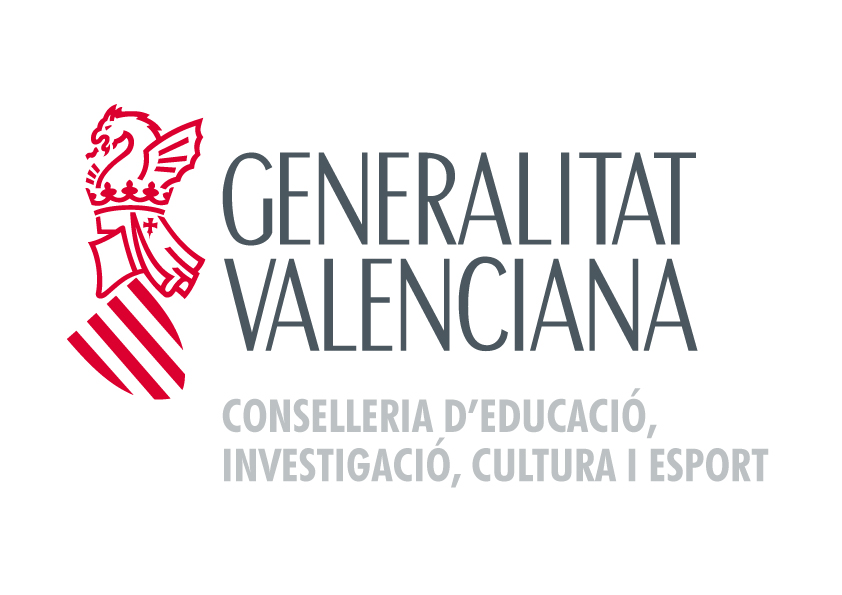

# Programación de Aula

## Informática I

### 1º BACHILLERATO

### *2026 – 2027*

---

**Profesor**: César Tomás Franco

---

## Información general del grupo

* **CURSO Y GRUPO:** 1º de Bachillerato
* **PROFESOR:** César Tomás Franco
* **CARACTERÍSTICAS DEL GRUPO:** Se trata de un grupo reducido de 8 alumnos (7 chicos y 1 chica) de nivel bastante homogéneo. La gran mayoría ha cursado previamente optativas relacionadas con la informática en 4º de ESO, lo que les proporciona una base técnica similar y muy favorable para el desarrollo práctico de las clases.
* **ALUMNADO REPETIDOR:** Ninguno.
* **ALUMNADO DE RECIENTE INCORPORACIÓN:** 2 alumnos (procedente de otros centros).
* **ALUMNADO CON NEE Y MEDIDAS ADOPTADAS:** En este momento inicial del curso, no se tiene constancia de la existencia de alumnado con necesidades educativas especiales. En caso de detectarse o de incorporarse alumnado con NEE, se adoptarán de manera inmediata las medidas de inclusión, flexibilización, adaptación de tiempos y atención individualizada establecidas en la normativa vigente.

---

## Situaciones de Aprendizaje (SA)

### SA 1: UD1 - Seguridad, Ética, Markdown y Presentaciones

* **Distribución temporal:** 8 sesiones.
* **Descripción:** Unidad didáctica de introducción que combina la reflexión ética sobre los retos de la sociedad digital con la aplicación práctica mediante el uso de Markdown y el diseño de presentaciones.
* **Secuenciación de actividades:**
* **Tarea 1:** Investigación sobre huella digital, bienestar y riesgos de la IA, redactada íntegramente en Markdown estructurado.
* **Tarea 2:** Creación y exposición de una presentación esquemática (10-15 diapositivas, 5-7 min) basada en la Tarea 1.
* **Prueba:** Kahoot sobre riesgos TIC, licencias y privacidad.

* **Recursos y materiales:** Ordenadores del aula, Pizarra Digital (ADI), Plataforma Aules, Codium / Visual Studio Code, Software de presentaciones.

| Competencias | Criterios de Evaluación | Saberes Básicos |
| --- | --- | --- |
| **CE4:** Ejercer ciudadanía digital ética. **CE2:** Generar y editar contenidos. | **4.1, 4.2, 4.3:** Analizar riesgos, actitudes proactivas y privacidad. **2.1, 2.4:** Aplicar funcionalidades ofimáticas. | - Identidad y huella digital. - Ciberconvivencia y privacidad. - Riesgos IA y licencias. - Markdown y presentaciones.

* **Medidas para la inclusión:** Aplicación de medidas ordinarias y atención personalizada.
* **Instrumentos de evaluación:** Evaluación de la redacción en Markdown (rúbrica), evaluación de la exposición oral y cuestionario de conocimientos.

---

### SA 2: UD2 - Hardware y Sistemas Informáticos

* **Distribución temporal:** 14 sesiones.
* **Descripción:** Unidad centrada en la arquitectura de las computadoras, donde el alumnado identificará los componentes físicos, analizará sus características y realizará el montaje y presupuestado de un equipo.
* **Secuenciación de actividades:**
* **Tarea 1:** Práctica de sistemas de representación y unidades de medida.
* **Tarea 2:** Elaboración de presupuestos de ordenadores aplicando restricciones de precio y uso.
* **Tarea 3:** Identificación, desmontaje y montaje guiado de componentes físicos de un ordenador del aula.
* **Prueba:** Kahoot de arquitectura y componentes.

* **Recursos y materiales:** Ordenadores en el aula, Pizarra Digital (ADI), Plataforma Aules, Equipos de hardware para desmontaje.

| Competencias | Criterios de Evaluación | Saberes Básicos |
| --- | --- | --- |
| **CE1:** Montar y configurar sistemas y redes en ámbito doméstico. | **1.1.** Identificar elementos y analizar coste/necesidad. **1.2.** Montar elementos hardware. **1.3.** Documentar el montaje. | - Unidades de medida. - Arquitectura y componentes. - Presupuestos y selección. - Montaje y configuración.

* **Medidas para la inclusión:** Aplicación de medidas ordinarias y atención personalizada.
* **Instrumentos de evaluación:** Observación directa durante el montaje, revisión de presupuestos justificados y prueba conceptual.

---

### SA 3: UD3 - Sistemas Operativos y Aplicaciones

* **Distribución temporal:** 12 sesiones.
* **Descripción:** Unidad que completa el bloque de sistemas informáticos, abordando la instalación, configuración y administración básica de sistemas operativos y software de uso personal.
* **Secuenciación de actividades:**
* **Tarea 1:** Instalación de sistemas operativos (Windows / Linux) empleando máquinas virtuales.
* **Tarea 2:** Uso de comandos básicos de consola (gestión de directorios y ficheros en Linux).
* **Tarea 3:** Creación de usuarios, gestión de permisos y elaboración de un breve manual técnico del proceso.
* **Prueba:** Examen final o prueba práctica.

* **Recursos y materiales:** Ordenadores en el aula, Pizarra Digital, Plataforma Aules, VirtualBox, ISOs de sistemas operativos.

| Competencias | Criterios de Evaluación | Saberes Básicos |
| --- | --- | --- |
| **CE1:** Montar y configurar sistemas y redes en ámbito doméstico. | **1.2.** Instalar SO y aplicaciones básicas. **1.3.** Elaborar documentación de los procesos. | - Arranque y BIOS. - SO libres y propietarios. - Usuarios y permisos. - Instalación de aplicaciones. 

* **Medidas para la inclusión:** Aplicación de medidas ordinarias y atención personalizada.
* **Instrumentos de evaluación:** Observación directa en máquinas virtuales, evaluación de manuales técnicos y examen práctico.

---

### SA 4: UD4 - Procesadores de Textos e Inteligencia Artificial

* **Distribución temporal:** 10 sesiones.
* **Descripción:** Unidad orientada al dominio de procesadores de texto y a la integración crítica de la Inteligencia Artificial generativa para la creación y estructuración de contenidos.
* **Secuenciación de actividades:**
* **Tarea 1:** Redacción y estructuración de un documento extenso aplicando estilos automáticos, tablas de contenido y referencias cruzadas.
* **Tarea 2:** Diseño y afinamiento de instrucciones (*prompts*) a una IA (ChatGPT/Claude) para redactar un informe, analizando posteriormente su veracidad y posibles sesgos.
* **Prueba:** Prueba práctica de formato de textos.

* **Recursos y materiales:** Ordenadores en el aula, LibreOffice Writer / Google Docs, Acceso a IA generativa.

| Competencias | Criterios de Evaluación | Saberes Básicos |
| --- | --- | --- |
| **CE2:** Generar, editar y explotar contenidos digitales mediante aplicaciones e IA. | **2.1.** Aplicar funcionalidades ofimáticas. **2.4.** Integrar aplicaciones e IA académicamente. | - Suites ofimáticas. - Estilos, formatos, tablas e índices. - Diseño de *prompts* de IA.

* **Medidas para la inclusión:** Aplicación de medidas ordinarias y atención personalizada.
* **Instrumentos de evaluación:** Entrega de archivos de texto con formatos validados y rúbrica de diseño de *prompts* (capacidad crítica).

---

### SA 5: UD5 - Hojas de Cálculo

* **Distribución temporal:** 12 sesiones.
* **Descripción:** Unidad enfocada en el tratamiento, análisis y explotación de datos mediante el uso de fórmulas matemáticas, funciones lógicas y representaciones gráficas.
* **Secuenciación de actividades:**
* **Tarea 1:** Batería de ejercicios de iniciación: funciones matemáticas y estadísticas básicas.
* **Tarea 2:** Uso de funciones lógicas (condicionales) y referencias absolutas/relativas.
* **Tarea 3:** Creación de un panel de datos visual con diferentes tipos de gráficos (sectores, barras, líneas).
* **Prueba:** Prueba práctica en hoja de cálculo.

* **Recursos y materiales:** Ordenadores en el aula, Pizarra Digital, LibreOffice Calc / Google Sheets.

| Competencias | Criterios de Evaluación | Saberes Básicos |
| --- | --- | --- |
| **CE2:** Generar, editar y explotar contenidos digitales. | **2.1.** Aplicar funcionalidades de hojas de cálculo. **2.4.** Integrar el uso de estas aplicaciones. | - Fórmulas y funciones matemáticas/estadísticas. - Formato de celdas y validación. - Gráficos de datos.

* **Medidas para la inclusión:** Aplicación de medidas ordinarias y atención personalizada.
* **Instrumentos de evaluación:** Revisión de las hojas de cálculo enviadas (evaluando las fórmulas subyacentes) y prueba práctica de validación.

---

### SA 6: UD6 - Imágenes Vectoriales y Nube

* **Distribución temporal:** 12 sesiones.
* **Descripción:** Unidad que introduce al alumnado en el diseño gráfico mediante dibujo vectorial y fomenta el trabajo en equipo a través de herramientas colaborativas en red.
* **Secuenciación de actividades:**
* **Tarea 1:** Configuración de un entorno colaborativo en la nube para el grupo-clase.
* **Tarea 2:** Recreación de logotipos conocidos utilizando nodos y curvas de Bézier.
* **Tarea 3:** Diseño de un logotipo propio original, exportación en SVG y publicación en la nube.

* **Recursos y materiales:** Ordenadores en el aula, Pizarra Digital, Plataforma colaborativa (Drive/OneDrive), Inkscape / Adobe Illustrator.

| Competencias | Criterios de Evaluación | Saberes Básicos |
| --- | --- | --- |
| **CE2:** Generar y publicar contenidos mediante trabajo colaborativo. | **2.1.** Crear imágenes vectoriales. **2.2.** Utilizar herramientas colaborativas. **2.3.** Difundir y publicar productos. | - Dibujo vectorial (curvas de Bézier, nodos). - Herramientas *cloud* y sincronización. - Difusión de contenidos.

* **Medidas para la inclusión:** Aplicación de medidas ordinarias y atención personalizada.
* **Instrumentos de evaluación:** Evaluación de la topología de los nodos en archivos SVG y verificación de la configuración del entorno colaborativo.

---

### SA 7: UD7 - Introducción a la Programación

* **Distribución temporal:** 30 sesiones.
* **Descripción:** Unidad enfocada al desarrollo del pensamiento computacional mediante el aprendizaje de la sintaxis y estructuras básicas del lenguaje Python.
* **Secuenciación de actividades:**
* **Tarea 1:** Introducción (sintaxis básica, `print`, `input`, variables). Batería de ejercicios cortos.
* **Tarea 2:** Estructuras de Control (`if`, `for`, `while`). Pequeños programas matemáticos/lógicos.
* **Tarea 3:** Funciones y resolución de retos algorítmicos.
* **Proyecto Final:** Programación completa del juego "Wordle" en consola.
* **Prueba:** Examen final algorítmico.

* **Recursos y materiales:** Ordenadores en el aula, Pizarra Digital, Codium / Visual Studio Code, Intérprete de Python.

| Competencias | Criterios de Evaluación | Saberes Básicos |
| --- | --- | --- |
| **CE3:** Analizar problemas técnicos y aplicar pensamiento computacional. | **3.1.** Identificar estructura de programa. **3.2.** Conocer sintaxis estructurada. **3.3.** Elaborar y depurar programas sencillos. | - Pensamiento computacional. - Variables, tipos de datos, E/S. - Estructuras de control. - Funciones y procedimientos.

* **Medidas para la inclusión:** Aplicación de medidas ordinarias y atención personalizada.
* **Instrumentos de evaluación:** Revisión de código fuente (comentarios y limpieza), funcionamiento interactivo del proyecto Wordle y examen final de programación.